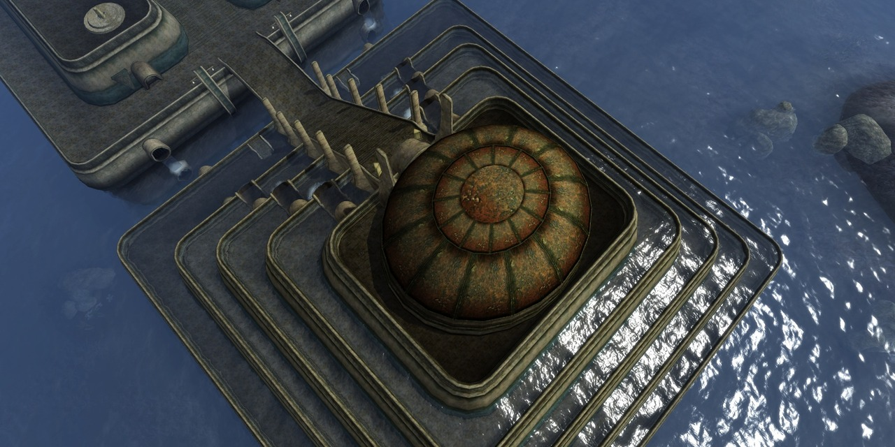

# True Water - MWSE Water Volumes



True Water lets a Morrowind mod place bodies of water that are not part of the cell's own
water: a pond on a hill, a river that runs downhill, a pool in an interior, a sphere of water
in the air. Actors swim in it, the breath meter runs, and the camera goes under water. The
water does not depend on the water level of the cell.

A body of water is a placed reference of a water mesh. You place it in the Construction Set
like any other Static. Disable it and the water goes; enable it and the water comes back; move
it and the water moves with it.

## Where to start

- **You make a mod and want water in it.** Read
  [`Water Volumes/GUIDE-construction-set.md`](Water%20Volumes/GUIDE-construction-set.md). It
  covers the kit, how the pieces snap together, a pond and a river step by step, the look of
  the surface, water of a colour, your own mesh, a mesh you cannot edit, and water far away.
  No Lua is needed.
- **You play or keep a modlist.** Read "Requirements" and "Compatibility and limits" below.
- **You want to build the plugin or change it.** Read "How it fits together" and "Building".

## What it does

- The water follows its reference when the reference is disabled, enabled, moved, turned,
  scaled or deleted, by a script or by Lua. The change shows on the next frame.
- The water is what is inside a closed mesh, at any tilt. A mesh that is only a surface is
  closed with a copy of itself a set depth below.
- Line of sight passes through the surface of the water.
- Fish stay in the water.
- Water can have a colour. With MGE XE, deep water tends to that colour. Under the surface of
  a coloured body, the plugin gives the colour to the game's underwater colour.
- With MGE XE the surface is drawn with its water shading, near and far away.

## Requirements

- **Morrowind with MWSE.** MWSE loads the plugin with `include("watervolumes")`. MWSE itself
  needs no change. The mod uses `tes3.dataHandler.waterController`, which MWSE has had since
  April 2023. The mod was tested only with a current build of MWSE.
- **The executable the plugin knows.** See "Which executable" below.
- **MGE XE, for the look of the water.** The look comes from MGE XE in a build with water
  volume support:
  [Greatness7/MGE-XE pull request 24](https://github.com/Greatness7/MGE-XE/pull/24), branch
  `feature/water-volumes` of the fork. The pull request is open and not merged, so no MGE XE
  release has the support. With that build, MGE XE draws the surfaces with its water shading,
  shows the colour of the water, gives the view under water, and draws water far away.
  Without it, actors still swim and the breath meter still runs, and the meshes are drawn
  with their own texture.

### Installing

The folder `Water Volumes/` is the mod as it is installed into `Data Files`: the Lua mod, the
kit meshes, `Water Volumes Kit.esm`, `distantwater.toml` and the guide. The plugin DLL is not
kept in this repository. Build it first (see "Building"); the build puts it at
`Water Volumes/MWSE/lib/watervolumes.dll`. Without the DLL the mod does nothing and writes
"MWSE/lib/watervolumes.dll was not found" to `MWSE.log`.

## Compatibility and limits

### Which executable

The plugin changes 82 places in `Morrowind.exe`. Before it changes any of them, it compares
the bytes at every place with the bytes it expects. If one place differs, it changes nothing
and the mod does nothing. `MWSE.log` then names the places, on a line that starts with
`[Water Volumes]`.

- The places were checked on one executable, the one of the test install. No other
  executable was tried. A different executable, or a patch that changes one of these places
  first, turns the mod off.
- A patch that changes the same places after the plugin takes them away, and nothing says
  so. `hookStatus()` in the table of the DLL returns how many of the 82 places still lead to
  the plugin.
- For 26 engine functions the plugin replaces the return address on the stack while the
  function runs. A crash dump taken inside one of them shows a small stub of the plugin where
  the caller should be. The real caller is in the frame list of the plugin (`frames` in
  `src/WaterVolumes.cpp`).

### Not together with a patched MWSE

The same patch once was part of MWSE, on branch `feature/water-volumes` of the MWSE fork. An
`MWSE.dll` built from that branch has already changed the places that the plugin patches, so
the plugin does not install and says so in `MWSE.log`. Use one or the other.

### What the mod changes in the game

- **Collision.** Nobody walks on water. The mod switches collision off for each water
  reference, unless the mesh already has no collision (an `NCO` text entry). Everything in a
  water mesh is passable, so a stone rim or rocks must be in a mesh of their own.
- **Interiors without water.** The engine asks for a water level only in a cell that has
  water. While an interior without water holds a water reference, the mod gives the cell
  water and puts the cell's own water far below everything.
- **Saves.** A save holds the game as it is without the mod: the mod puts the collision and
  the water flag of those interiors back while the save is written.

### Limits

- A piece is water to swim in only while its cell is one of the loaded cells around the
  player. Keep each piece inside one cell.
- Water has no sides of its own. Where a piece stands free of terrain and walls, the player
  and walking creatures can step out of its side and fall.
- The water has no current.
- Walking creatures do not follow into the water.
- Under water, MGE XE shows one level surface at the height of the camera.
- Scripts that read the water level get the level of the cell, not of a piece.

The guide has the full list, under "Limits".

## How it fits together

1. `Water Volumes/MWSE/mods/waterVolumes/interop.lua` loads the DLL and calls `install()`.
2. `main.lua` finds the Statics and Activators whose mesh is marked as water, or whose id a
   mod registered. It prepares their meshes and gives each reference to the plugin while its
   cell is active. The top of `interop.lua` says how a mesh is marked and lists the options.
3. The plugin reads the triangles of the mesh. A shape named `WaterBody` gives the sides and
   the bottom of the water. The Construction Set shows it; the game hides it.
4. Once per frame the mod calls the plugin, which looks at every reference it was given:
   where the reference is, whether it is disabled or deleted, and which mesh it has. The water
   follows. Nothing is done per reference in Lua per frame, and the call makes no garbage.
5. When the engine asks for the water level, the plugin answers for the actor, camera or
   position in question. Its hooks are on the code for swimming, breathing, water walking,
   actor movement and collision, AI destinations and combat, projectiles, the camera's
   underwater state, and line of sight.

### How a mesh becomes water

A mesh is water in one of two ways:

- Something in the mesh has a name that starts with `WaterVolume`. Options follow in the same
  name: `depth=300`, `plain`, `skyonly`, `noswim`. A mesh with a shape or node named
  `WaterBody` is water without the tag.
- A Lua mod registers the object id with `registerObject`, for a mesh it cannot edit.

The colour of the water is the emissive colour of the material of the surface shape. Black,
which most materials have, is water of the usual colour.

### The Lua interface

Mods use `waterVolumes.interop`:

| Name | What it does |
| --- | --- |
| `registerObject(id, settings)` | Makes a Static or Activator water by its id. `settings` takes `depth`, `plain`, `skyOnly`, `noSwim` and `color` (`"RRGGBB"` or three numbers from 0 to 1) |
| `setWorldWaterColor(color)` | Gives a colour to the water of the cell, the sea or the water of an interior, apart from the volumes. Nil or black gives the usual colour back. It lasts until it is changed or the game is closed |
| `getVolumeSurfaceAt(position)` | The height of the surface of the water that a position is in or over, or nil |
| `supported` | True once the engine hooks of the plugin are in place |
| `problem` | Why the hooks are not in place, when they are not |
| `native` | The table of the DLL, or nil when the DLL is missing |

Water always belongs to a placed reference. A Lua mod that wants water at run time places a
reference of a water mesh with `tes3.createReference` and handles it like any other
reference.

The table of the DLL (`interop.native`) has `install`, `addReference`, `update`, `remove`,
`setColor`, `surfaceAt`, `count` and `hookStatus`. `src/plugin.cpp` describes each, and
`src/WaterVolumes.h` describes the functions behind them. `setColor` gives a volume the colour
that the game's underwater colour takes while the camera is under its surface.

### Logging

The plugin has no log of its own. What it has to say comes back to the mod, which writes it
to `MWSE.log`. Two messages come from inside the engine hooks and go to the debugger output:
a reference handed over from another thread, and the notice before the plugin stops the game
because a hooked function returned with no record of its caller.

### Water far away

Beyond the game's own view distance, MGE XE draws from its distant land data. Its generator
reads `Water Volumes/distantwater.toml` from the data folder: the names that mark the surface
and the body of the water in a mesh, and the words `plain` and `skyonly`. A mesh that a Lua mod
registered by id has no such names; give it a line in that file, or in the metadata file of
the plugin that places it. The file has the format of MGE XE's plugin metadata and carries a
version of its own, so the rules can change with this mod. A water surface becomes a distant
static with a water flag, which the renderer draws with its water shading in place of its
texture. This needs the MGE XE build named under "Requirements"; an older build does not read
the file.

## Repository layout

| Path | What it holds |
| --- | --- |
| `src/` | The plugin, `watervolumes.dll`. `Geometry.cpp` decides where the water is and knows nothing of the game. `WaterVolumes.cpp` holds the volumes and the hooks. `plugin.cpp` is the Lua table |
| `Water Volumes/` | The mod as it is installed: the Lua mod, the kit, `Water Volumes Kit.esm`, `distantwater.toml`, the guide, and a short README for players |
| `Water Volumes/meshes/wv/` | The 37 kit meshes: squares, discs, corners, river pieces, and four solids |
| `Water Volumes/meshes/wvs/`, `wvm/`, `wvb/` | The kit again in the swamp, mud and blood colours |
| `tools/make_kit.py` | The script that writes the kit |
| `tests/geometry_test.cpp` | Tests of the geometry, which run without the game |
| `deps/mwse-upstream/` | Submodule: the MWSE source that the plugin compiles against |

## Building

The plugin is a 32-bit DLL, because Morrowind is 32-bit. You need Visual Studio 2022 with C++
and CMake 3.21 or newer.

After cloning, get the MWSE submodule. It is pinned to the MWSE commit that the plugin was
built and checked against:

```pwsh
git submodule update --init --recursive
```

The plugin links against LuaJIT. LuaJIT ships as source inside that submodule
(`deps/mwse-upstream/deps/rubic0n/src`) and has to be built once. Open a Visual Studio x86
developer prompt in that directory and run:

```bat
msvcbuild.bat lua52compat
```

This makes `lua51.lib`, which the plugin links against. At run time MWSE supplies
`lua51.dll`.

Then configure and build:

```pwsh
cmake --preset win32-release
& "C:\Program Files\Microsoft Visual Studio\2022\Community\MSBuild\Current\Bin\MSBuild.exe" `
  build\win32-release\water-volumes-plugin.sln -t:Build -p:Configuration=Release -p:Platform=Win32
```

`cmake --build --preset win32-release` does the same build without the path to MSBuild.

The Release DLL goes to `Water Volumes\MWSE\lib\watervolumes.dll`, and its PDB stays in
`pdb` in the build folder. A Debug build goes to `debug-lib` in the build folder and never
replaces the Release DLL.

- To build against another MWSE checkout, configure with `-DMWSE_ROOT=<path>`.
- `CMakeLists.txt` lists the MWSE source files that are compiled into the DLL. If the linker
  reports an unresolved `NI::` symbol after the submodule moves, add the file that defines it.

## The kit

`tools/make_kit.py` is the one place where the kit pieces are defined. It is a Python script
and writes the meshes, `Water Volumes Kit.esm`, and `kit.json`, the list of the pieces with
their sizes and joints. Its list `PALETTES` gives the colours in which the whole kit is
written again. After a change to a piece or to a palette, run it and commit what it writes:

```pwsh
python tools\make_kit.py "<Data Files>\Morrowind.esm"
```

## Tests

Without the game: the build makes `wv_geometry_test.exe`. It checks where the water is for a
box, a sheet closed below, a sloped sheet, a mesh that is not closed, bodies over one another,
a closed body at many tilts, and edges that two triangles share. It also checks the lookup
grid against a search of every triangle.

```pwsh
ctest --test-dir build\win32-release -C Release
```

In the game: the mod was tested with scripted scenarios that run inside a separate test
harness. The harness and the scenarios are not part of this repository. One check is known to
fail: the first time the player is put straight into water raised over the sea, the player
ends on the sea floor. The cause is not known.

## Licence

The files of this repository are under the MIT licence. See `LICENSE`.

The built DLL contains code of MWSE, which is under the GNU General Public License, version 2.
A built DLL is therefore distributed under that licence, together with its source. `LICENSE`
states this, and `COPYING-GPL-2.0.txt` holds the text of the GNU General Public License.
